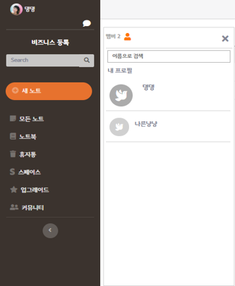

# NEST-Project
## Overview

## Function

## DB 설계

## 담당 임무
자료 저장 담당
1. 노트(문서) 작성
2. 노트북 생성
3. 이미지, 파일 첨부
4. 템플릿 형식 저장 및 적용
5. 휴지통
## Skills

## 랜딩 페이지
One-Page로 서비스에 대한 간략한 설명을 제공하도록 하였습니다.

## 회원 관련 기능
### 회원가입
회원가입시 해야하는 기본적인 유효성검사를 하였습니다.

* 이메일, 이름, 비밀번호, 비밀번호 확인, 주민등록번호, 닉네임, 핸드폰번호를 입력받고 해당 데이터가 입력되지 않았을 경우 해당 태그에 포커싱되게 하고 회원가입이 되지 않게 하였습니다.
* 이메일은 ex) test@gmail.com 처럼 @ 앞에 아이디 뒤에 메일주소를 입력하지 않으면 회원가입이 되지 않도록 하였습니다.
* 작성한 이메일로 인증번호를 발송하여 이메일 인증을 하도록 JavaMailSender 라이브러리와 네이버 SMTP(POP3 방식)을 사용하였습니다.
* 회원정보 등록시 DB에서 이메일의 중복 여부를 체크하여 중복되어있을 경우 중복된 이메일이라는 경고창과 함께 회원가입이 되지 않도록 하였습니다.
* 이름은 2~10글자 이내로 한글 및 영문만 입력하게 하였습니다.
* 비밀번호와 비밀번호 확인은 영문+숫자+특수문자 조합으로 8~16이내의 정보를 입력하지 않거나 둘의 값이 다를 경우 회원가입이 되지 않도록 하였습니다.

### ID / PWD 찾기
핸드폰 비밀번호 인증을 통해 ID / PWD를 찾을 수 있도록 하였습니다.

## 노트
노트의 작성을 위하여 위지윅 에디서 TinyMCE API를 사용하였습니다.
* 글꼴편집, 표 삽입, 코드 변환이 가능합니다.
* 이미지편집이 가능하지만, 이미지업로드와 파일업로드 기능을 제공하지 않아 커스터마이징을 통해 직접 기능을 구현하였습니다.

<pre><code>
// 파일, 이미지 업로드 커스터마이징 코드입니다.

</code></pre>
<pre><code>
// NoteController.java
@RequestMapping(value = "/a/images", method = RequestMethod.POST)
@ResponseBody
public String handleTinyMCEUpload(@RequestParam("files") MultipartFile files[],HttpSession session) {
    System.out.println("uploading______________________________________MultipartFile " + files.length);
    // 업로드 될 파일의 경로
    String filePath = "/resources/uploads/images/" + files[0].getOriginalFilename();
    String result = uploadFilesFromTinyMCE("images", files, false,session);
    System.out.println(result);
    return "{\"location\":\"" + filePath + "\"}";

}
@RequestMapping(value = "/a/files", method = RequestMethod.POST, produces = "application/String; charset=utf8")
@ResponseBody
public String handleTinyMCEUpload2(@RequestParam("files") MultipartFile files[],HttpSession session) {
    System.out.println("uploading______________________________________MultipartFile " + files.length);
    String filePath = "/resources/uploads/files/" + files[0].getOriginalFilename();
    String result = uploadFilesFromTinyMCE("files", files, false,session);
    System.out.println(result);
    return "{\"location\":\"" + filePath + "\"}";
}
private String uploadFilesFromTinyMCE(String prefix, MultipartFile files[], boolean isMain,HttpSession session) {
  ServletContext context=session.getServletContext();
    System.out.println("uploading______________________________________" + prefix);
    try {
        // 폴더 경로
        String folder = context.getRealPath("/") + "/resources/uploads/" + prefix+"/";
        StringBuffer result = new StringBuffer();
        byte[] bytes = null;
        result.append("Uploading of File(s) ");

        for (int i = 0; i < files.length; i++) {
            if (!files[i].isEmpty()) {
                try {
                    boolean created = false;
                    try {
                        // 폴더 생성
                        File theDir = new File(folder); 
                        theDir.mkdir();
                        created = true;
                    } catch (SecurityException se) {
                        se.printStackTrace();
                    }
                    if (created) {
                        System.out.println("DIR created");
                    }
                    String path = "";
                    path = folder + files[i].getOriginalFilename();
                    File destination = new File(path);
                    System.out.println("--> " + destination);
                    System.out.println("파일전송");
                    // 경로에 파일 전송
                    files[i].transferTo(destination);
                    result.append(files[i].getOriginalFilename() + " Succsess. ");
                } catch (Exception e) {
                    throw new RuntimeException("Product Image saving failed", e);
                }
            } else
                result.append(files[i].getOriginalFilename() + " Failed. ");
        }
        return result.toString();

    } catch (Exception e) {
        return "Error Occured while uploading files." + " => " + e.getMessage();
    }
}
</code></pre>

### 새 노트

### 노트북

### 템플릿
### 휴지통

## 스페이스
### 스페이스 생성

### 노트 조회 / 보기

### 중요 노트 고정

### 실시간 채팅 서비스

