# NEST-Project
## Overview
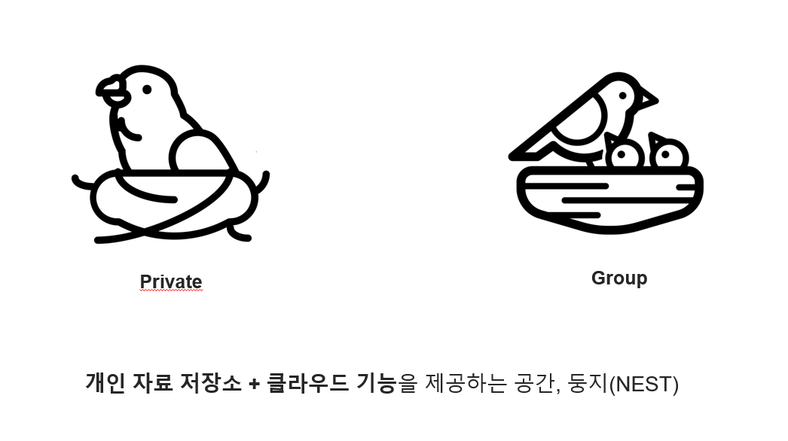
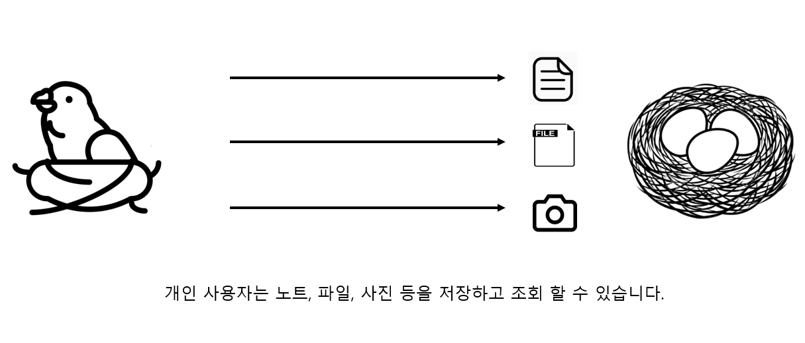
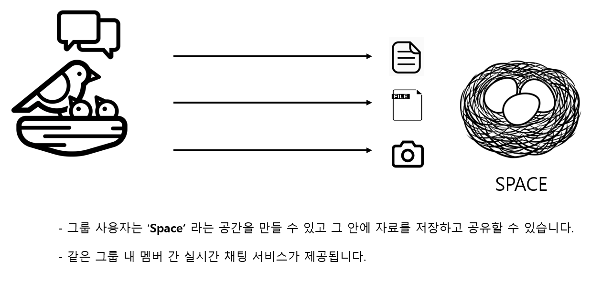
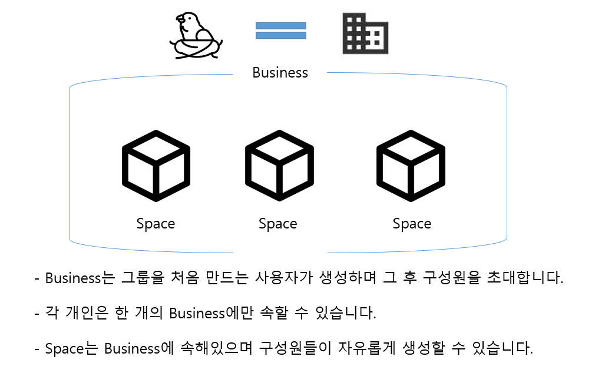
## Function
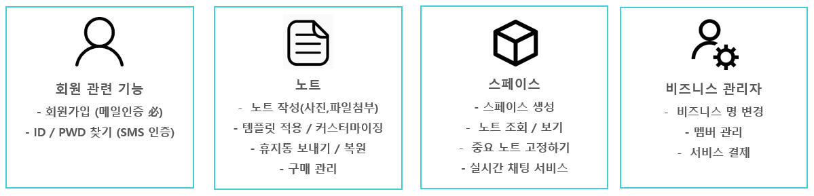
## DB 설계
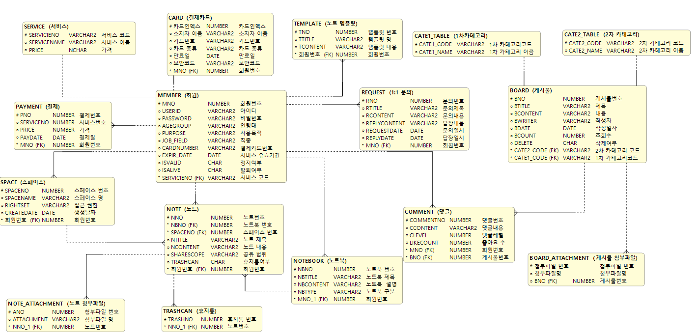
## 담당 임무
자료 저장 담당
1. 노트(문서) 작성
2. 노트북 생성
3. 이미지, 파일 첨부
4. 템플릿 형식 저장 및 적용
5. 휴지통
## Skills
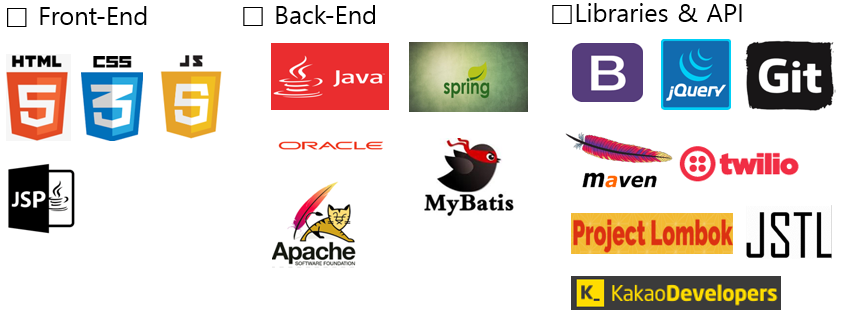
## 랜딩 페이지
One-Page로 서비스에 대한 간략한 설명을 제공하도록 하였습니다.
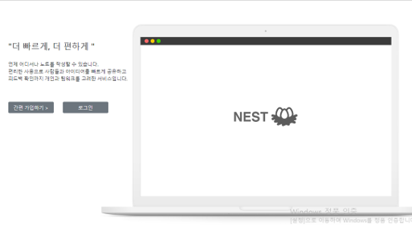
## 회원 관련 기능
### 회원가입
회원가입시 해야하는 기본적인 유효성검사를 하였습니다.

* 이메일, 이름, 비밀번호, 비밀번호 확인, 주민등록번호, 닉네임, 핸드폰번호를 입력받고 해당 데이터가 입력되지 않았을 경우 해당 태그에 포커싱되게 하고 회원가입이 되지 않게 하였습니다.
* 이메일은 ex) test@gmail.com 처럼 @ 앞에 아이디 뒤에 메일주소를 입력하지 않으면 회원가입이 되지 않도록 하였습니다.
* 작성한 이메일로 인증번호를 발송하여 이메일 인증을 하도록 JavaMailSender 라이브러리와 네이버 SMTP(POP3 방식)을 사용하였습니다.
* 회원정보 등록시 DB에서 이메일의 중복 여부를 체크하여 중복되어있을 경우 중복된 이메일이라는 경고창과 함께 회원가입이 되지 않도록 하였습니다.
* 이름은 2~10글자 이내로 한글 및 영문만 입력하게 하였습니다.
* 비밀번호와 비밀번호 확인은 영문+숫자+특수문자 조합으로 8~16이내의 정보를 입력하지 않거나 둘의 값이 다를 경우 회원가입이 되지 않도록 하였습니다.
  
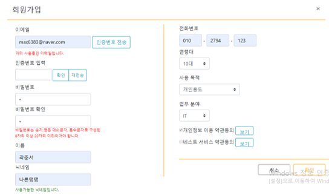
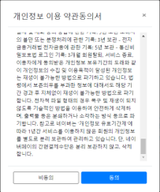
### ID / PWD 찾기
핸드폰 비밀번호 인증을 통해 ID / PWD를 찾을 수 있도록 하였습니다.
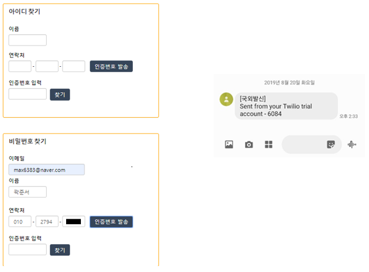
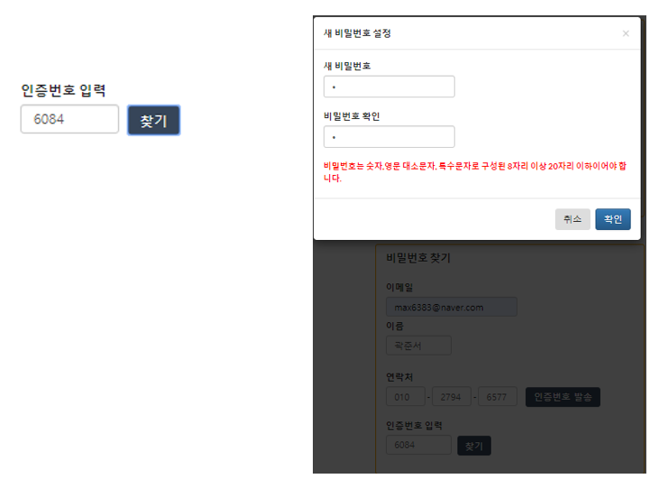
## 노트

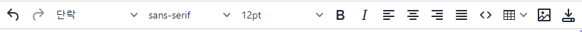
  
노트의 작성을 위하여 위지윅 에디서 TinyMCE API를 사용하였습니다.
* 글꼴편집, 표 삽입, 코드 변환이 가능합니다.
* 이미지편집이 가능하지만, 이미지업로드와 파일업로드 기능을 제공하지 않아 커스터마이징을 통해 직접 기능을 구현하였습니다.
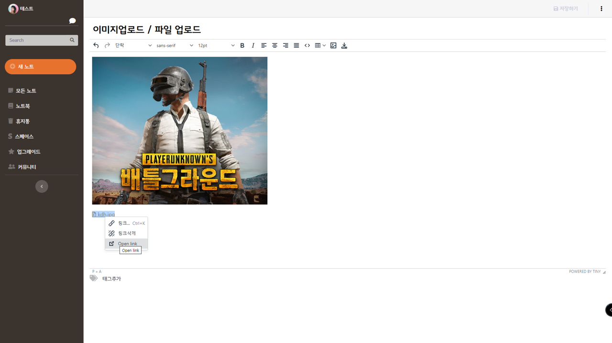
<pre><code>
// 파일, 이미지 업로드 커스터마이징 코드입니다.

</code></pre>
<pre><code>
// NoteController.java
@RequestMapping(value = "/a/images", method = RequestMethod.POST)
@ResponseBody
public String handleTinyMCEUpload(@RequestParam("files") MultipartFile files[],HttpSession session) {
    System.out.println("uploading______________________________________MultipartFile " + files.length);
    // 업로드 될 파일의 경로
    String filePath = "/resources/uploads/images/" + files[0].getOriginalFilename();
    String result = uploadFilesFromTinyMCE("images", files, false,session);
    System.out.println(result);
    return "{\"location\":\"" + filePath + "\"}";

}
@RequestMapping(value = "/a/files", method = RequestMethod.POST, produces = "application/String; charset=utf8")
@ResponseBody
public String handleTinyMCEUpload2(@RequestParam("files") MultipartFile files[],HttpSession session) {
    System.out.println("uploading______________________________________MultipartFile " + files.length);
    String filePath = "/resources/uploads/files/" + files[0].getOriginalFilename();
    String result = uploadFilesFromTinyMCE("files", files, false,session);
    System.out.println(result);
    return "{\"location\":\"" + filePath + "\"}";
}
private String uploadFilesFromTinyMCE(String prefix, MultipartFile files[], boolean isMain,HttpSession session) {
  ServletContext context=session.getServletContext();
    System.out.println("uploading______________________________________" + prefix);
    try {
        // 폴더 경로
        String folder = context.getRealPath("/") + "/resources/uploads/" + prefix+"/";
        StringBuffer result = new StringBuffer();
        byte[] bytes = null;
        result.append("Uploading of File(s) ");

        for (int i = 0; i < files.length; i++) {
            if (!files[i].isEmpty()) {
                try {
                    boolean created = false;
                    try {
                        // 폴더 생성
                        File theDir = new File(folder); 
                        theDir.mkdir();
                        created = true;
                    } catch (SecurityException se) {
                        se.printStackTrace();
                    }
                    if (created) {
                        System.out.println("DIR created");
                    }
                    String path = "";
                    path = folder + files[i].getOriginalFilename();
                    File destination = new File(path);
                    System.out.println("--> " + destination);
                    System.out.println("파일전송");
                    // 경로에 파일 전송
                    files[i].transferTo(destination);
                    result.append(files[i].getOriginalFilename() + " Succsess. ");
                } catch (Exception e) {
                    throw new RuntimeException("Product Image saving failed", e);
                }
            } else
                result.append(files[i].getOriginalFilename() + " Failed. ");
        }
        return result.toString();

    } catch (Exception e) {
        return "Error Occured while uploading files." + " => " + e.getMessage();
    }
}
</code></pre>

### 새 노트
개인 노트 저장소 입니다.
* 노트를 작성할 수 있습니다.
* 모든 노트 메뉴를 통해 작성한 모든 노트를 확인 할 수 있습니다.
* 노트를 삭제, 수정, 복사가 가능합니다.
  
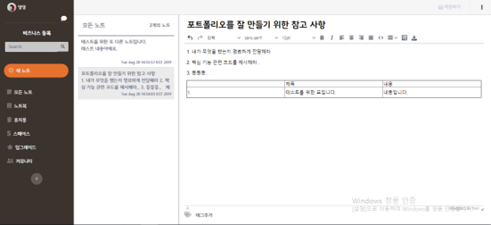
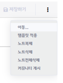
  
#### 이동
노트를 다른 노트북으로 이동이 가능합니다.
  
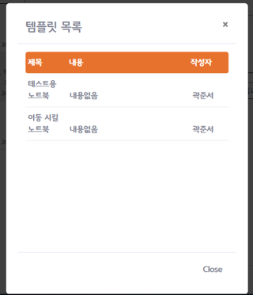
### 노트북
노트북은 노트들을 사용자의 의도대로 분류하여 저장할 수 있습니다.
* 새 노트북을 추가할 수 있습니다.
* 노트북의 이름 수정, 삭제가 가능합니다.
  
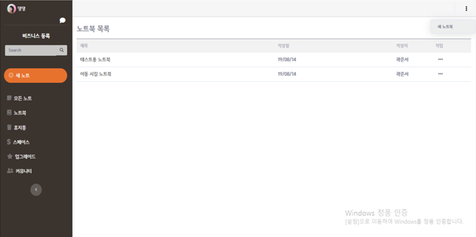
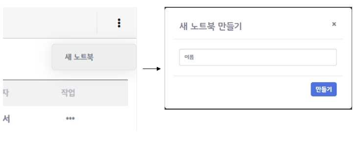
### 템플릿
사용자가 용이하게 노트필기를 할 수 있도록 템플릿을 제공합니다.
* 개인이 템플릿을 제작하여 저장할 수 있습니다.
* 저장한 템플릿을 커뮤니티를 통해 공유가 가능합니다.
  
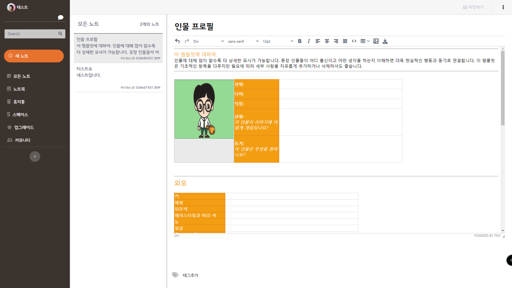
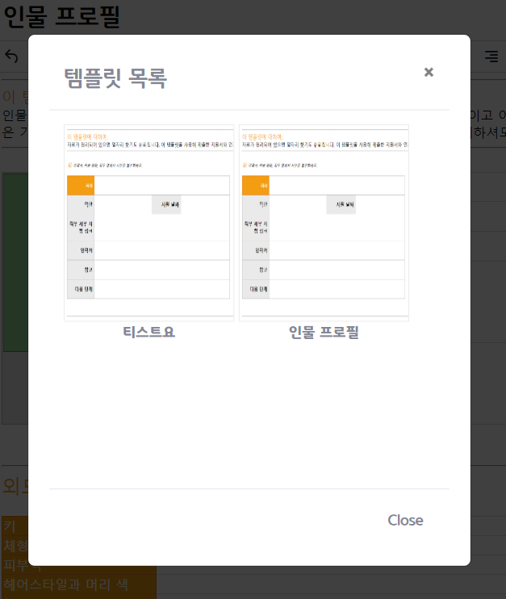
### 휴지통
삭제한 노트들은 휴지통으로 이동하여 관리하게 됩니다.
* 휴지통에 있는 노트들을 휴지통비우기, 삭제, 복원이 가능합니다.
* 휴지통에 있는 노트들의 trashCan 컬럼은 모두 Y, 복원 후 N으로 변경됩니다.
  
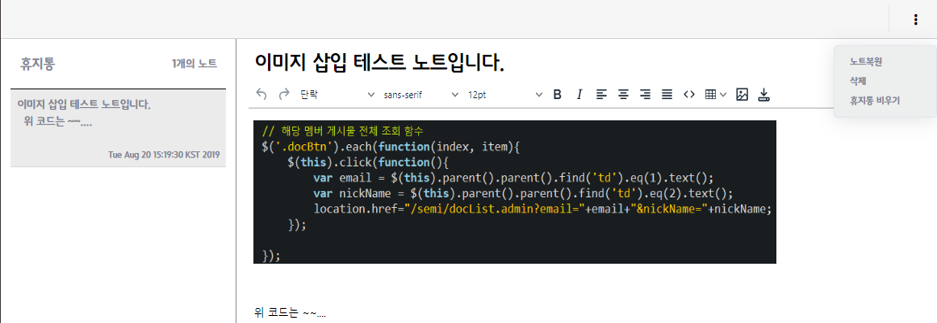
### 커뮤니티
사용자가 개인저장소의 노트를 공유하거나 작성할 수 있는 페이지입니다.
* 게시글 공유, 삭제, 수정, 작성이 가능합니다.
* 카테고리 별로 공유할 수 있도록 Modal을 띄워 설정하도록 하였습니다.
  
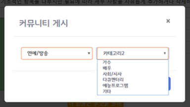
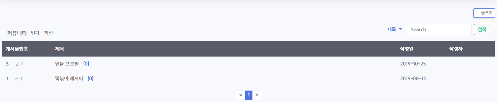
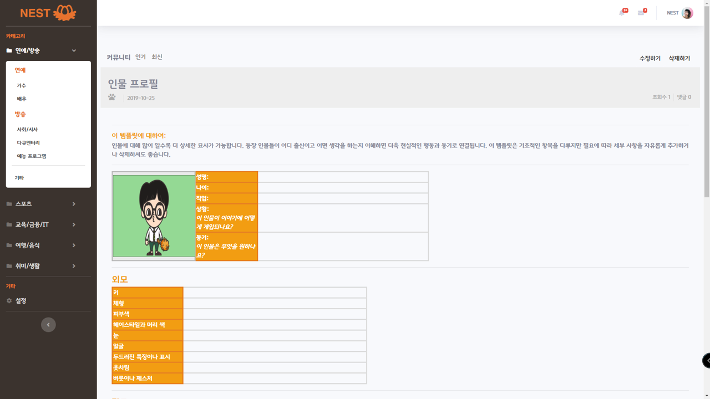
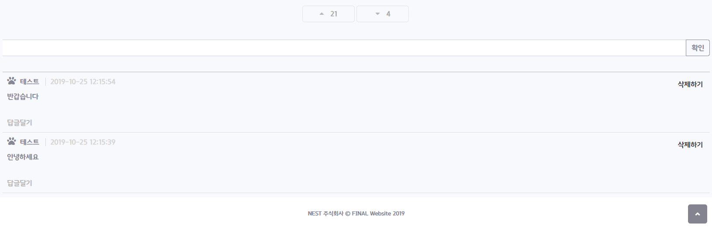
## 스페이스
그룹 사용자들 만의 Space 공간입니다. 
### 스페이스 생성
스페이스를 생성할 수 있습니다.
  
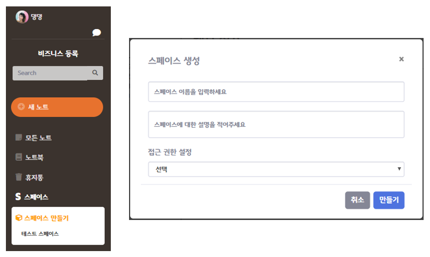
### 노트 조회 / 보기
함께 사용하고 있는 노트북, 노트를 확인할 수 있습니다.
  
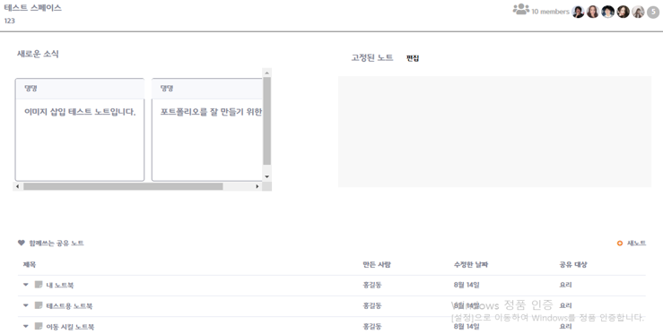
### 중요 노트 고정
그룹 사용자는 중요 노트로 선정하여 고정시킬 수 있습니다.
* 체크 된 노트의 Primary key를 전달하여 Fixed 컬럼 값을 ‘Y’로 바꿔 줍니다 
* 반대의 경우 ‘N’으로 바꿔줍니다.
  
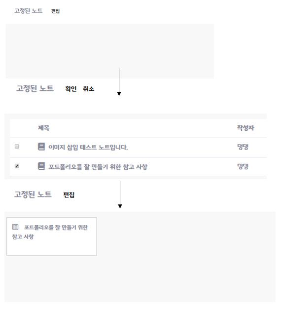
### 실시간 채팅 서비스
그룹 사용자 간 1대1 채팅 서비스입니다.
* 같은 비즈니스 멤버 수를 보이도록 하였습니다.
* 채팅상대목록을 조회할 수 있습니다.
  
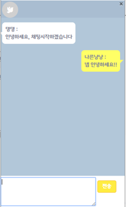
#### 채팅 서버 및 MongoDB 연결
* Node.js를 사용한 채팅서버를 작동시키고 이를 이용해 소켓 객체를 만듭니다.
* 동시에 채팅 내역을 저장하기 위한 MongoDB를 연결합니다.
<pre><code>
// node 서버 활성화 소켓통신 연결
var express = require('express');
var http = require('http');

var app = express();
var server = http.createServer(app);
server.listen(3000);

console.log("채팅서버 작동");

var socket = io("localhost:3000");

socket.on('connect',function(){
	console.log('서버와 연결');
});

// MongoDB 연결
const MongoClient = require('mongodb').MongoClient;
const assert = require('assert');

// Connection URL
const url = 'mongodb://localhost:27017';

// Database Name
const dbName = 'myproject';

// Create a new MongoClient
const client = new MongoClient(url,{ useNewUrlParser: true });

var io = require('socket.io')(server);

// MongoDB 연결
var db = "";
client.connect(function(err) {
	  assert.equal(null, err);
	  console.log("MongoDB와 연결되었습니다.");  
	   db = client.db(dbName);
});

</code></pre>
#### Room 설정
* BroadCast가 아닌, 1:1 소켓통신을 위해서 Room 설정이 필요합니다.
* Oracle에 저장되어 있는 Room 정보를 가져오고 없을 시 새로 생성 후 가져옵니다.
* 채팅 시작 시 Client는 ‘joinRoom’ 이벤트를 발생시키고 Server는 핸들러를 통해 사용자를 Room 번호에 맞게 방에 입장시켜줍니다.
<pre><code>
// Room 번호 설정(Client)
function chatStartFn(nickName){

$('#chattingContainer').show();
// 로그인한 사용자의 닉네임과 대화를 하고자하는 상대의 닉네임으로 RoomNo 생성 Or 조회

$.ajax({
	url : '${pageContext.request.contextPath}/space/selectChatRoomNo.do?chatter1='+ '${member.nickName}' + '&chatter2=' + nickName,
	type : 'get',
    dataType : 'json',
    success : function(data){
	console.log(nickName + "과의 채팅 시작");
	window.roomNo = data;
	socket.emit('joinRoom',{roomNo : data});

    }, error : function(msg){
	console.log("에러 발생");
    }

});

window.receiver = nickName;
console.log("receiver : " + window.receiver);
$('#chatArea').children().remove();
}

// 상대방과 채팅을 시작하려 할때 이벤트 리스폰
socket.on('joinRoom',function(data){

	var roomNo = data;
	socket.join(data.roomNo);

});
</code></pre>

#### 채팅내역 가져오기
대화하고 있는 서로의 닉네임을 파라미터로 chatLogs를 MongoDB에서 조회하여 가져옵니다.
<pre><code>
// 기존 채팅 내역 가져오기
socket.emit('callChatLogs',{receiver: receiver, sender: '${member.nickName}'});

// 상대방과의 채팅로그 요청하는 이벤트 발생 시
socket.on('callChatLogs',function(data){

   findDocuments(db,data,function(logs){
	  console.log("보내는 로그들 : " + logs);
	 socket.emit('returnChatLogs',{logs:logs});

   });

});
</code></pre>

## 채팅 전송 및 화면 상에 업데이트
닉네임, Room 번호를 매개로 DB에 저장함과 동시에 Front에서도 채팅 내역을 업데이트 해준다.
<pre><code>
// 메세지 전송 이벤트 발생
$('#sendMsg').on('click',function(){
  msgContent = $('#msgContent').val();

  socket.emit('sendMsg',{msg : msgContent, sender: '${member.nickName}', receiver: receiver,roomNo:roomNo});

  $('#msgContent').val('');
});

// 메세지 전송 이벤트 발생시
socket.on('sendMsg',function(data){

  // 상대방과 자신의 채팅창에 전송 메세지를 띄우기 위한 이벤트
  io.to(data.roomNo).emit('serverResponse', {msg : data.msg, sender : data.sender, receiver:data.receiver } );

  // DB에 채팅 내역 저장
  insertDocuments(db,data,function() {
  });

});

// 전송한 메세지 서버로부터 응답받는 이벤트 핸들러
socket.on('serverResponse',function(data){
   console.log(data);
  if(data.sender == '${member.nickName}'){

	 $('#chatArea').append("
" + data.sender  + " :   " + data.msg+ "
"); 

  }else{

	  $('#chatArea').append("
" + data.sender  + " :   " + data.msg+ "
"); 
  }
		scrollDown();
});

</code></pre>

## 프로젝트 후기
### 참여소감
이번 프로젝트는 세미프로젝트의 경험을 살려 계획을 가지고 진행을 했기 때문에 구현에 쓰이는 시간보다 디테일한 부분까지 고쳐 나가면서 완성도를 높이는 과정에서 많은 시간은 들였다. 테스트의 중요성을 몸소 깨닫고 기간 내에 완료하여 오류 없이 완성도 높은 기능 구현을 해서 뿌듯했다.
