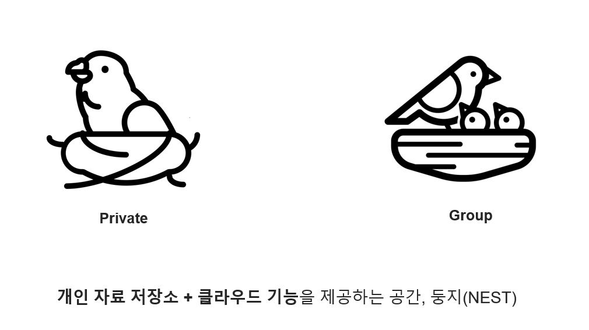

# NEST-Project
## Overview

## Function

## DB 설계

## 담당 임무
자료 저장 담당
1. 노트(문서) 작성
2. 노트북 생성
3. 이미지, 파일 첨부
4. 템플릿 형식 저장 및 적용
5. 휴지통
## Skills

## 랜딩 페이지

## 회원 관련 기능
### 회원가입

### ID / PWD 찾기

## 노트
위지윅 API 설명
### 새 노트

### 노트북

### 템플릿
### 휴지통

## 스페이스
### 스페이스 생성

### 노트 조회 / 보기

### 중요 노트 고정

### 실시간 채팅 서비스

